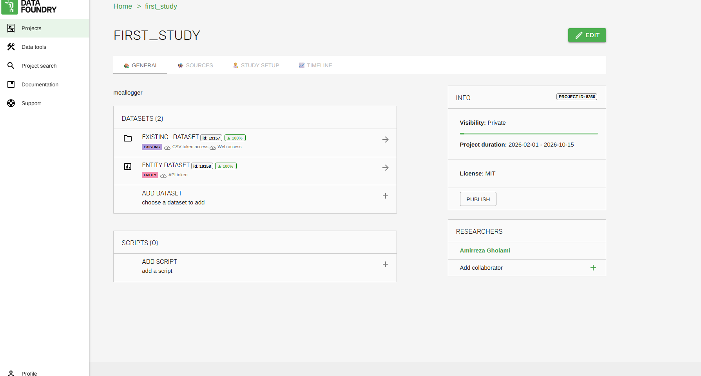
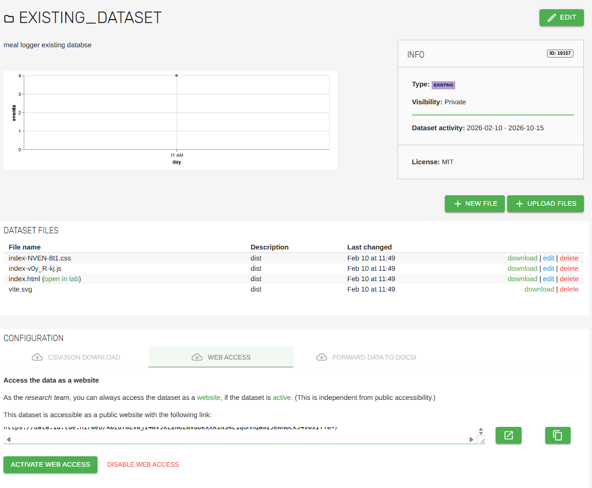
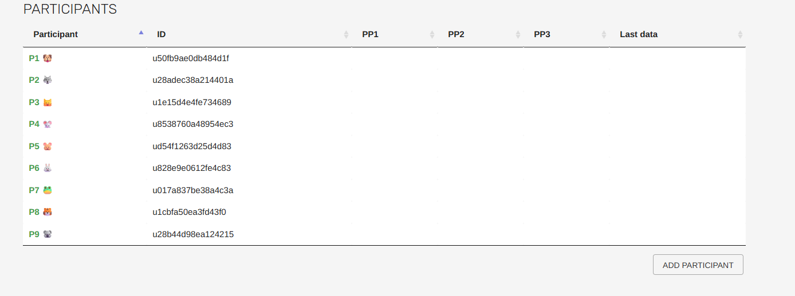
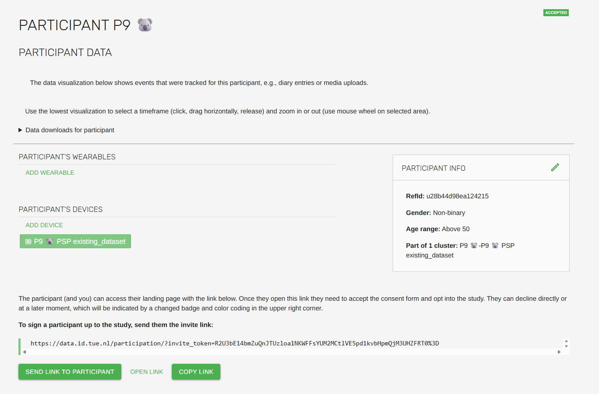

# Meal Logger App

A React-based meal logging application with AI-powered food recognition and classification using the NEVO food group system.

## 🔍 Project Overview

This is a mobile-first web application that helps users log their meals with the assistance of AI. The app can process text descriptions, voice input, and food images to identify and classify foods according to the official NEVO (Netherlands Food Database) food group system.

### Key Features

- **Multimodal Input**: Support for text, voice, and image input
- **AI Food Recognition**: Powered by AI Foundry for intelligent food identification
- **NEVO Classification**: Automatic classification into 27 official NEVO food groups
- **Saved Foods**: Save frequently eaten foods for quick logging
- **Recent Foods**: Access recently logged meals
- **Contextual Questions**: Optional questions about meal context
- **Participant Management**: Multi-participant support
- **Mobile Responsive**: Optimized for mobile devices

## 🚀 Getting Started

### Prerequisites

- Node.js (v16 or higher)
- npm or yarn

### Installation

1. **Clone the repository**
   ```bash
   git clone <repository-url>
   ```

2. **Install dependencies**
   ```bash
   npm install
   ```

3. **Set up environment variables**
   Create a `.env` file in the root directory:
   ```env
   VITE_AI_FOUNDRY_API_KEY=your-ai-foundry-api-key-here
   VITE_DATASET_API_KEY=your-dataset-api-key-here
   VITE_DB_ID=your_entity_dataset_id
   VITE_DATABASE_BASE_URL=https://data.id.tue.nl/api/v1/datasets/entity/
   ```

4. **Start development server and open the it in browser**
   ```bash
   npm run dev
   ```


## 📊 Data Foundry Study Setup

### Setting Up Your Research Study in TU/e Data Foundry

Follow these steps to deploy your meal logging application and collect research data:

#### Step 1: Create Project in Data Foundry
1. **Login to Data Foundry**
   - Go to [https://data.id.tue.nl]
   - Sign in with your TU/e credentials

2. **Create New Project**
   - Navigate to your dashboard
   - Click "Add Project" or "New Project"
   - Fill in project details (name, description, etc.)

#### Step 2: Set Up Databases

You need to create **two different databases** for your project:


##### Database 1: Existing Dataset (for hosting your app)
1. **Add Existing Dataset**
   - In your project, add a new database
   - Select "Existing Dataset" type
   - This will host your built application files
     

2. **Configure Web Access**
   - After creating the database, go to "Web Access" settings
   - **Activate web access** - this generates a public URL
   - **Save the URL** - this is where users will access your application

    

##### Database 2: Entity Dataset (for data collection)
1. **Add Entity Dataset**
   - Add another database to your project
   - Select "Entity Dataset" type
   - This will store your meal logging data
   

2. **Configure HTTP Data Upload**
   - Go to database configuration
   - Find "HTTP Data Upload" section
   - **Copy the Database ID** (e.g., 19158)
   - **Copy the API Token** (long encoded string)
   - **Note the base URL pattern**: `https://data.id.tue.nl/api/v1/datasets/entity/`

#### Step 3: Configure Environment Variables

Update your `.env` file with the Data Foundry credentials:

```env
# Get these from your Data Foundry project
VITE_AI_FOUNDRY_API_KEY=your-project-api-key-from-data-foundry
VITE_DATASET_API_KEY=your-entity-dataset-token-here
VITE_DB_ID=your-entity-dataset-id-here
VITE_DATABASE_BASE_URL=https://data.id.tue.nl/api/v1/datasets/entity/
```


**How to get the API key:**
1. Go to your project in Data Foundry
2. Click "Edit Project" or "Settings"
3. Navigate to "Study Setup" tab
4. Find "API Key" section
5. Click "Create API Key" or copy existing key
6. Add this key as `VITE_AI_FOUNDRY_API_KEY` in your `.env` file

#### Step 4: Build and Deploy Application

1. **Build your project** with the configured environment variables:
   ```bash
   npm run build
   ```

2. **Upload to Data Foundry**
   - Go to your **Existing Dataset** (Database 1)
   - Upload all files from the `dist/` folder
   - Make sure to upload the entire contents of the dist folder

3. **Test the deployment**
   - Use the web access URL from Step 2 to access your application
   - Verify that the application loads correctly
   - Test meal logging functionality to ensure data is being saved

#### Step 5: Study Management

##### Adding Participants to Your Study

1. **Navigate to Participants**
   - Go to your project in Data Foundry
   - Click on the "Resource" tab
   - Select "Add Participant"

2. **Add Individual Participants**
   - Click "Add Participant" 
   - Select "One Person" option
   - Fill in participant details
   - The participant will be added to the participant field
   

3. **Generate Unique Participant Links**
   - Click on the participant in the participant list
   - You will see a unique shareable link for that participant
   - **Share this link** with the specific participant
   - Each participant gets their own unique URL for the study duration

   
   
   

4. **Managing Your Study**
   - **Participant tracking**: Each participant has their own unique access link
   - **Data isolation**: Data is automatically linked to the correct participant via their unique URL
   - **Study duration**: Participants can use their unique link throughout the entire study period
   - **Monitor data collection** through the Entity Dataset
   - **Access collected data** via Data Foundry's data export features

### Important Notes

- **Build order matters**: Configure your `.env` file BEFORE building the project
- **Final deployment**: Upload the `dist` folder contents as the very last step
- **Web access**: The generated URL allows participants to access your study from any device

## 🏗️ Build Process

### Development
```bash
npm run dev
```
Starts the Vite development server with hot module replacement.

### Production Build
```bash
npm run build
```
Creates an optimized production build in the `dist` folder.


## 🤖 AI Configuration & Prompts

### Prompt Location
All AI prompts are located in: `src/config/prompts.json`

### Prompt Types

#### 1. System Message (`systemMessage`)
- **Purpose**: Main conversational AI prompt for chat interactions
- **Used for**: Text input, voice transcription, image analysis
- **Behavior**: Neutral food logging assistant that asks clarifying questions

#### 2. Summarization Prompt (`summarizationPrompt`)
- **Purpose**: NEVO food group classification and JSON output
- **Used for**: Final food classification before data saving
- **Output**: JSON structure with food names and NEVO groups

#### 4. Recent Food Prompt (`recentFoodPrompt`)
- **Purpose**: Context for when user selects from recent foods or saved foods
- **Behavior**: References previous consumption patterns

### How to Modify Prompts

1. **Edit the prompts file**
   ```bash
   src/config/prompts.json
   ```

2. **Update specific prompts**
   ```json
   {
     "systemMessage": "Your new system prompt here...",
     "summarizationPrompt": "Your classification prompt here..."
   }
   ```

3. **Restart the development server**
   Changes to JSON files require a restart to take effect.

### Modifying Configuration Files

You can change prompts and extra questions from the **config folder**:

- **Prompts**: `src/config/prompts.json`
- **Extra Questions**: `src/config/extraInfoQuestions.json`

For extra questions, keep the JSON structure while adding new data:


After making changes:
1. **Build the application**: `npm run build`
2. **Put the dist folder files in your project existing database in Data Foundry**
3. Upload all files from `dist/` to replace existing files

**Important**: Always rebuild and redeploy after configuration changes!


## 🎯 Usage Flow

1. **Select Meal Type**: Choose breakfast, lunch, dinner, or snack
2. **Log Food**: Use text, voice, or image to describe food
3. **AI Processing**: AI identifies and asks clarifying questions
4. **Confirm Logging**: Review and confirm the food log
5. **Extra Information**: Optionally answer contextual questions
6. **Data Saving**: Food is classified and saved with NEVO groups


## 📊 Database Structure

### Data Organization

Each participant gets a **unique ID number** for easy data analysis per person. The database structure allows you to easily analyze data per participant.

**Example data structure:**
```
4255 (9)                           // Participant ID
├── 2026-02-10           // Timestamp
├── savedFoods: (Array)           // Saved foods for quick logging
│   ├── 0: (Object)
│   │   ├── mealtype: dinner
│   │   ├── food: Chicken and potatoes.
│   │   └── savedDate: 10/02/2026
│   └── 1: (Object)
│       ├── mealtype: lunch
│       ├── food: meet
│       └── savedDate: 10/02/2026
├── 2026-02-09: (Object)          // Date entries
│   └── dinner: (Object)          // Meal type
│       ├── food: "Chicken and potatoes. 
│       ├── questions: (Object)   // Extra information responses
│       └── nevoGroup: { "food_name": "Chicken and potatoes", "food_group": "Meat and poultry", "summary": "..." }
└── 2026-02-10: (Object)          // Another date
    ├── breakfast: (Object)
    │   ├── food: "I detected one food in your input: 
    │   ├── questions: (Object)
    │   └── nevoGroup: { "food_group": "Cheese", "summary": "You had cheese as a meal." }
    └── lunch: (Object)
        ├── food: "I understood that you ate meat..."
        ├── questions: (Object)
        └── nevoGroup: { "food_name": "Meat", "food_group": "Meat and poultry", "preparation": "Not specified" }
```


